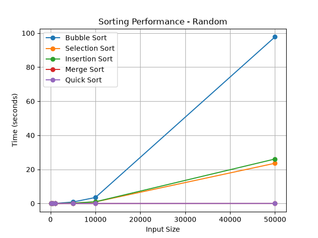
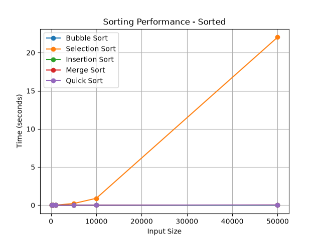
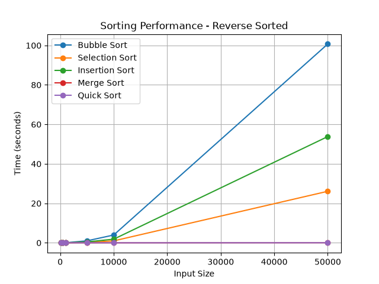
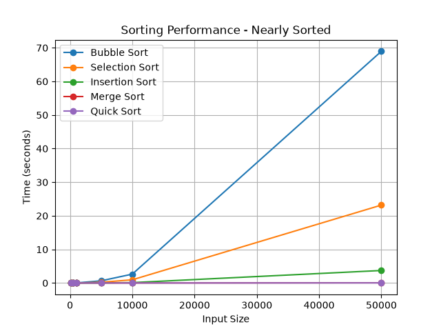
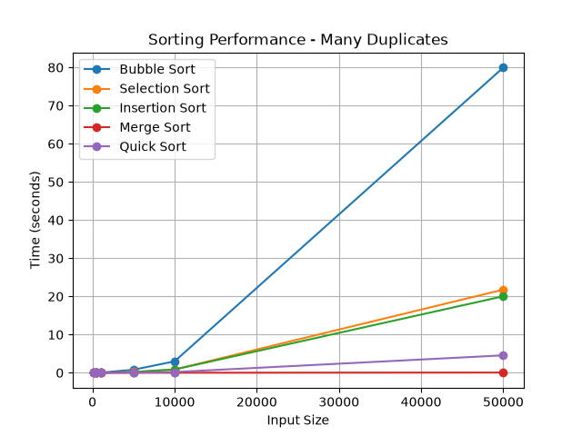
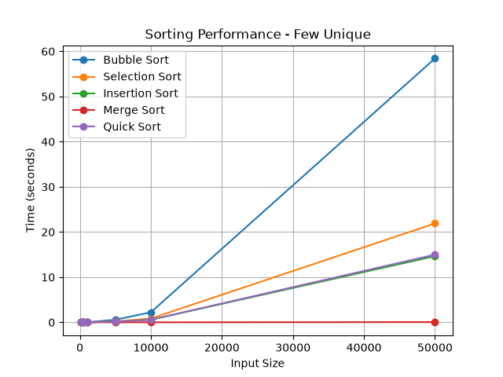

# Week 2 Performance Report

## Executive Summary

This project compared five sorting algorithms: Bubble Sort, Selection Sort, Insertion Sort, Merge Sort, and Quick Sort. I tested each algorithm with input sizes from 100 to 50,000 elements across random, sorted, reverse-sorted, nearly sorted, and duplicate-heavy datasets. Overall, the benchmark demonstrated a large performance difference between the O(n²) algorithms and the O(n log n) algorithms as input sizes increased. Merge Sort produced the most consistent performance, while Quick Sort performed extremely well on general data but performed worse on datasets with very few unique values.

## Methodology

I ran the benchmarks in an Ubuntu virtual machine using Python. The tests used Python's time counter to measure each sorting algorithm. I chose this timer because it provides high-resolution timing suitable for comparing algorithms with very short execution times.

The following input sizes were tested:

- 100
- 500
- 1,000
- 5,000
- 10,000
- 50,000

The benchmark compared Bubble Sort, Selection Sort, and Insertion Sort algorithms from Week 1 assignments, with Week 2 algorithms of Merge Sort and Quick Sort.

## Results

### Overall Performance Comparison

The results showed that input size strongly affected the O(n²) sorting algorithms.

| Algorithm | Expected Complexity | General Observation |
|---|---|---|
| Bubble Sort | O(n²) | Slowest on large datasets |
| Selection Sort | O(n²) | More consistent than Bubble Sort but still slow |
| Insertion Sort | O(n²) | Strong on sorted/nearly sorted data |
| Merge Sort | O(n log n) | Fast and highly consistent |
| QuickSort | O(n log n) average | Very fast on general data |

The results are available in:

`benchmarks/results/comparison_table.csv`

Performance plots for each input type are also included in the benchmark results directory.

The results O(n log n) algorithms became especially clear on random data. At 50,000 elements, Bubble Sort required approximately **97.76 seconds**, Selection Sort required **23.60 seconds**, and Insertion Sort required **26.10 seconds**. In comparison, Merge Sort completed in approximately **0.0612 seconds**, while QuickSort completed in approximately **0.0344 seconds**.

At this size, QuickSort was a lot faster than Bubble Sort. These results demonstrate how complexity has a major practical effect once input sizes become large.

### Sorted Data Performance

Already sorted data benefited algorithms that can take advantage of existing order. Bubble Sort performs much better on already sorted data than in its worst case. Insertion Sort also performs efficiently when elements are already in their correct positions.

Merge Sort remained comparatively consistent 

Reverse sorted represented a difficult case for the algorithms because many elements had to be compared, swapped, or shifted.

### Nearly Sorted Performance

Nearly sorted data showed the strengths of Insertion Sort. Although its worst-case complexity is O(n²), it can perform better when a small number of values are out of place. 

### Duplicate-Heavy Data

Duplicate-heavy input produced one of the most interesting findings. Merge Sort performed consistently even when many values were the same. Quick Sort, however, became slower on the dataset containing three unique values.

## O(n²) vs O(n log n) Speedup Analysis

For an O(n²) algorithm, increasing the input size can result in four times as much work. In contrast, an O(n log n) algorithm is normally faster when the input size increases.

Bubble Sort, Selection Sort, and Insertion Sort took seconds or even minutes at 50,000 elements, while Merge Sort typically remained within milliseconds.

## Complexity Validation

### Merge Sort

The theoretical complexity of Merge Sort is O(n log n). Its runtime increased as input size increased and remained stable across different inputs.

One downside of Merge Sort is that it uses more memory. Since it keeps creating new lists while splitting and merging the data, it needs extra space to run. So even though Merge Sort is fast and consistent, it uses more memory than some other sorting algorithms. 

### QuickSort

QuickSort has an average-case time complexity of O(n log n) and a worst-case complexity of O(n²).

The duplicate heavy tests showed that randomized pivot selection does not eliminate all performance problems. When many values are equal, repeated partitions can increase running time.

## Optimization Impact

Quick Sort used Insertion Sort when a section had 10 or fewer elements. This helps avoid doing extra recursive Quick Sort calls on really small sections. Insertion Sort works well here because it is simple and can be very fast when the list is small.

Random pivot selection also improved Quick Sort's on sorted and reverse-sorted data. The results also showed that Quick Sort could be improved by using three-way partitioning. This would help it handle lists with a lot of duplicate values more efficiently. 

## Practical Recommendations

Bubble Sort is mostly useful for learning how sorting works or for really small lists. Selection Sort is also easy to understand, but it slows down a lot as the list gets bigger. Insertion Sort works well for small lists or lists that are already almost sorted, and it can also be useful inside other sorting algorithms.

Merge Sort is a good option when you want steady performance and don't mind using extra memory. Quick Sort is also a good general sorting method because it is usually fast and sorts efficiently in place. However, it can slow down when the data has many duplicate values, depending on how the partitioning is done.

## Conclusion

The benchmark results showed that algorithm selection becomes very important as dataset size grows. Bubble Sort, Selection Sort, and Insertion Sort perform decently on small inputs, but their O(n²) growth makes them a poor choice for large, general datasets. Merge Sort and Quick Sort are more efficient because of their O(n log n) behavior.

The experiment also showed that complexity is only one part of algorithm performance. Input sizes, duplicate values, randomization, recursion, and implementation optimizations can change the actual execution time. Overall, the benchmark results supported the differences while also revealing strengths and weaknesses of the algorithms.

## References

Cormen, T. H., Leiserson, C. E., Rivest, R. L., & Stein, C. (2022). Introduction to algorithms (4th ed.). MIT Press.

CS50. (2026, January 1). CS50x 2026 - Lecture 3 - Algorithms [Video]. YouTube.

Amakobe, M. (n.d.). Chapter 1: Introduction & algorithmic thinking. In Advanced algorithms: A journey through computational problem solving. Global Data Science Institute.
